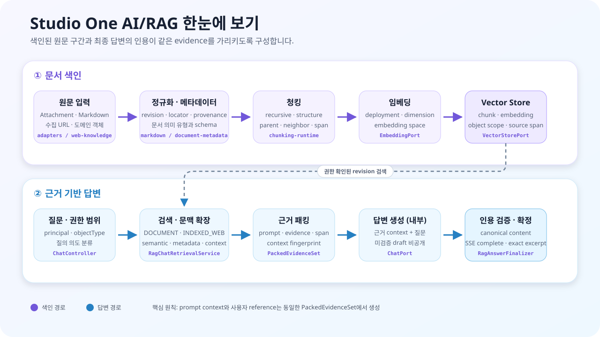

# Studio One Platform

[](https://github.com/donghyuck/studio-api/tree/3.x)
[](LICENSE.md)

모듈화된 Spring Boot 기반 백엔드 플랫폼. 인증/인가, 사용자/그룹 관리, 파일·첨부 관리, 템플릿,
메일, 실시간 메시징, AI 임베딩/RAG 파이프라인과 공개 HTTPS 자료 수집·색인을 공통 컴포넌트와
스타터로 제공한다. 설정은 `spring.*`, `studio.features.<module>.*`, `studio.<module>.*`의 3층 모델을 따른다.

## 빠른 시작
1. JDK 17을 준비한다. 빌드는 저장소의 Gradle Wrapper를 사용한다.
2. 필요한 secret을 셸 환경변수 또는 로컬 전용 `~/.gradle/gradle.properties`에 넣는다.
3. 루트에서 `./gradlew clean build`를 실행한다.
4. 애플리케이션에서는 필요한 starter만 선택해 의존성에 추가한다.

최소 확인용 명령:

```bash
./gradlew clean build
```

필수 secret 예시는 [.env.example](.env.example)에서 확인한다.

## 기술 기준
- Java toolchain / source compatibility: `17`
- Gradle Wrapper: `8.14.5`
- Spring Boot: `4.1.0`
- Spring AI: `2.0.0`
- MyBatis Spring Boot Starter: `4.0.1`
- JSON application boundary: Jackson `3`
- Spring Dependency Management Plugin: `1.1.7`
- Release candidate: `3.0.0-rc.1`

## 3.x 호환성과 업그레이드

`3.x`는 Spring Boot 4와 Spring AI 2를 기준으로 한 major line이다. 애플리케이션은
`studio.one.*:3.0.0-rc.1` artifact를 동일하게 사용해야 하며, 2.x와 3.x artifact를 한
runtime classpath에 혼합하지 않는다.

주요 호환성 경계는 다음과 같다.

- 애플리케이션 JSON 매핑은 Jackson 3 API를 사용한다.
- Spring Boot 4의 MVC와 Flyway starter 분리를 반영한다.
- Spring AI 2 provider starter와 모델 옵션 계약을 사용한다.
- RAG exact-answer cache는 선택 기능이며 기본값은 `none`이다. Redis 장애 시 provider
  호출로 fail-open한다.
- 기존 `@Cacheable` 도메인 cache와 RAG answer cache의 직렬화 경계는 분리한다.

업그레이드 및 검증 상세는 [3.x 업그레이드 기준선](docs/dev/3x-upgrade-baseline.md), Redis
승격 절차는 [RAG cache rollout](docs/dev/redis-rag-cache-rollout.md)을 따른다. 2.x로
롤백할 때는 RAG cache를 먼저 비활성화하고 `v2.1.0-rc.1` 기준의 platform과 server
property set을 함께 복원한다.

## 레포지토리 구성
```
starter/                         # Spring Boot 스타터 모음 (자동 구성)
  studio-application-starter-web-knowledge/ # URL 수집·색인 자동 구성
studio-application-modules/      # 애플리케이션 기능 모듈 (attachment, web knowledge, avatar, embedding pipeline, template, mail)
  web-knowledge-service/         # 공개 HTTPS 단일 페이지·bounded 사이트 수집과 revision/corpus 관리
studio-platform/                 # 코어 플랫폼 라이브러리
studio-platform-objecttype/      # objectType 레지스트리/정책/런타임 검증 구현
studio-platform-ai/              # AI/RAG 공통 계약과 포트
studio-platform-ai-model-catalog/ # AI 모델 capability 카탈로그
studio-platform-chunking/        # RAG indexing용 chunking 계약
studio-platform-chunking-runtime/ # 청킹 전략과 context expansion 구현
studio-platform-document-metadata/ # 문서 의미 유형과 metadata schema 계약
studio-platform-markdown/        # Markdown document/revision/pipeline 계약
studio-platform-thumbnail/       # image/PDF 썸네일 생성 SPI
studio-platform-autoconfigure/   # 공통 자동 구성
studio-platform-data/            # 데이터 액세스 공통
studio-platform-data-mybatis/    # MyBatis mapper convention 공통
studio-platform-identity/        # 인증/식별 추상화(계약)
studio-platform-security(+acl)/  # 보안 + ACL
studio-platform-realtime/        # 실시간 기능(웹소켓 등) 공통
studio-platform-storage/         # 오브젝트 스토리지 공통
studio-platform-user/            # 사용자/그룹/역할/회사 도메인 (계약)
studio-platform-user-default/    # 사용자 기본 구현 (엔터티/리포지토리/서비스/컨트롤러)
studio-platform-workspace/       # Workspace tree/member/permission 계약
studio-platform-workspace-default/ # Workspace JPA 기본 구현
```

## 주요 모듈
- `studio-platform`: 공통 웹/예외/도메인 계약
- `studio-platform-security`, `studio-platform-security-acl`: 인증/인가, JWT, ACL
- `studio-platform-user`, `studio-platform-user-default`: 사용자 계약과 기본 구현
- `studio-platform-data`, `studio-platform-data-mybatis`, `studio-platform-objecttype`, `studio-platform-realtime`, `studio-platform-workspace`: 데이터, MyBatis convention, objectType, 실시간 기능, workspace 공통
- `studio-platform-ai`, `studio-platform-ai-model-catalog`: AI/RAG 공통 계약과 모델 capability 카탈로그
- `studio-platform-chunking`, `studio-platform-chunking-runtime`: chunking 계약과 전략/context expansion 구현
- `studio-platform-document-metadata`, `studio-platform-markdown`: 문서 의미 metadata와 Markdown revision/pipeline 계약
- `studio-platform-thumbnail`, `studio-platform-storage`, `studio-platform-identity`: 썸네일 생성, 저장소, 식별 공통
- `studio-application-modules/*`: attachment, 공개 HTTPS 단일 페이지·bounded 사이트 수집/색인, avatar, embedding pipeline, template, mail

세부 설정, 엔드포인트, 확장 포인트는 각 모듈 README를 참고한다.
외부 URL 자료는 기본적으로 한 페이지만 수집하며, 선택적인 `SITE` 모드는 sitemap과 링크를 동일
origin·허용 경로·서버 budget 안에서만 따라간다. 페이지별 변경 이력과 고정 corpus revision을 사용하므로
refresh 중에도 RAG 근거가 바뀌지 않는다. 자세한 구성은
[`studio-application-starter-web-knowledge`](starter/studio-application-starter-web-knowledge/README.md)를 참고한다.

### 외부 URL RAG 사용 흐름

1. 애플리케이션에 web knowledge, AI web, chunking starter와 embedding provider를 추가한다.
2. `/api/workspaces/{workspaceId}/ai/rag/web-sources`에 공개 HTTPS URL을 등록한다.
3. `COMPLETED` 상태의 page revision 또는 corpus revision을 선택해 RAG 요청의 `indexedWebSources`에 넣는다.
4. 답변의 `INDEXED_WEB` reference에서 canonical URL, locator와 exact excerpt를 확인한다.

`SINGLE_PAGE`는 입력한 한 페이지만 처리한다. `SITE`는 별도 활성화가 필요하며 동일 origin·허용 경로와
depth/page/time/size budget 안에서만 수집한다. 수집 중인 mutable source가 아니라 완료된 revision을
질문에 고정하므로 refresh와 동시에 질의해도 답변 근거가 바뀌지 않는다.

RAG 답변 범위는 검색 정책과 분리된 서버 정책으로 관리한다. 서버 기본값·최대 허용 모드와 요청의
`answerMode`를 한 번 해석한 결과를 프롬프트, 인용 검증, exact cache, SSE 완료 이벤트와 대화 metadata가
공유한다. `STRICT_GROUNDED`는 문서에 직접 명시된 사실만, `GROUNDED_INFERENCE`는 문서 근거에서의
합리적 해석까지 허용한다. 상세 계약과 rollout 설정은
[`studio-platform-starter-ai-web`](starter/studio-platform-starter-ai-web/README.md)을 참고한다.

## AI/RAG 한눈에 보기

Studio One의 RAG는 파일이나 도메인 원문을 검색 가능한 작은 근거 단위로 색인하고, 사용자의 질문과
관련된 원문 구간만 LLM에 전달해 답변과 인용을 함께 만드는 기능이다. 단순한 vector 검색을 넘어
문서 revision, 의미 metadata, 청킹 provenance, embedding identity, object 권한과 citation 검증을
하나의 흐름으로 연결한다.



그림의 위쪽은 자료 색인 경로다. Attachment·Markdown뿐 아니라 수집한 공개 HTTPS 페이지를 정규화하고
metadata를 추출한 뒤 검색에 적합한 chunk로 분할한다. `SINGLE_PAGE`는 페이지 revision을, `SITE`는
완료된 페이지 집합을 고정한 corpus revision을 사용한다. 각 chunk는 선택한 embedding deployment로
vector화되며 원문 위치, revision과 `DOCUMENT` 또는 `INDEXED_WEB` origin을 함께 저장한다.

아래쪽은 근거 기반 답변 경로다. 요청 권한과 질의 의도를 확인하고 같은 object scope에서 관련 chunk를
검색한다. 실제 prompt와 화면의 근거 목록은 하나의 `PackedEvidenceSet`에서 만들어진다. 생성된 답변은
citation 번호와 원문 span 검증을 통과해야 canonical 답변으로 확정된다. SSE는 생성 중 상태만 보내며
검증 전 draft 본문은 노출하지 않고 마지막 `complete.canonicalContent`를 최종 결과로 사용한다.

### 구성요소

| 구성요소 | 쉬운 설명 | 주요 모듈 |
|---|---|---|
| 원문 연결 | Attachment, Markdown, 도메인 데이터를 RAG 입력으로 연결 | `content-embedding-pipeline`, `studio-platform-markdown` |
| 외부 웹 수집 | 공개 HTTPS 한 페이지 또는 제한된 사이트를 안전하게 수집하고 고정 revision으로 색인 | `web-knowledge-service`, `studio-application-starter-web-knowledge` |
| 문서 metadata | 책·논문·보고서 유형과 제목·저자·발간일의 근거를 관리 | `studio-platform-document-metadata`, starter-markdown |
| 청킹 | 긴 문서를 검색 가능한 단위로 나누고 원문 위치와 문맥 관계를 보존 | `studio-platform-chunking`, `studio-platform-chunking-runtime` |
| 모델 카탈로그 | 채팅·임베딩 모델의 capability와 workload를 공통 관리 | `studio-platform-ai-model-catalog` |
| 임베딩·검색 | chunk를 vector로 저장하고 질문과 관련된 근거를 검색 | `studio-platform-ai`, `studio-platform-starter-ai` |
| 근거 패킹 | 검색 결과를 prompt 한도에 맞추고 번호순 evidence와 span을 생성 | `studio-platform-starter-ai-web` |
| 답변·인용 | sync/SSE 답변의 citation을 검증하고 canonical 결과를 확정 | `studio-platform-starter-ai-web` |
| 운영 cache | 검증된 exact answer만 재사용하고 Redis 장애 시 provider로 우회 | `studio-platform-starter-ai-web` |

구현하거나 문제를 진단할 때는 [AI/RAG 아키텍처 가이드](docs/ai-rag/README.md)에서 모듈 책임과
색인·근거 답변의 상세 계약을 먼저 확인한다.

| 목적 | 문서 |
|---|---|
| 전체 모듈 지도와 최소 조합 | [AI/RAG 아키텍처](docs/ai-rag/README.md) |
| 추출·metadata·청킹·embedding·vector 저장 | [RAG 색인](docs/ai-rag/indexing.md) |
| retrieval·evidence·citation·SSE | [근거 기반 RAG Chat](docs/ai-rag/grounded-chat.md) |
| 기동·진단·cache·장애 대응 | [AI/RAG 운영](docs/ai-rag/operations.md) |

## 스타터
각 기능은 대응되는 스타터를 추가하면 자동 구성된다. 요약은 `starter/README.md` 참고.
예시:
```kotlin
dependencies {
    implementation(project(":starter:studio-platform-starter"))          // 플랫폼 기본
    implementation(project(":starter:studio-platform-starter-security")) // 보안
    implementation(project(":starter:studio-platform-starter-user"))     // 사용자
    implementation(project(":starter:studio-platform-starter-objecttype")) // objectType
    implementation(project(":starter:studio-application-starter-attachment")) // 첨부
}
```

대표적인 선택 기준:
- 공통 웹/데이터/JPA 기반은 `:starter:studio-platform-starter`
- 인증/인가가 필요하면 `:starter:studio-platform-starter-security`
- 사용자 기본 구현까지 필요하면 `:starter:studio-platform-starter-user`와 `:studio-platform-user-default`
- objectType 정책/검증이 필요하면 `:starter:studio-platform-starter`와 `:starter:studio-platform-starter-objecttype`
- MyBatis mapper convention이 필요하면 `:starter:studio-platform-starter-mybatis`
- workspace tree/member/permission API가 필요하면 `:starter:studio-platform-starter-workspace`
- STOMP/WebSocket 실시간 알림이 필요하면 `:starter:studio-platform-starter-realtime`
- 첨부/아바타/템플릿/메일 같은 기능 모듈은 각 application starter를 추가
- 공개 URL을 workspace RAG 자료로 사용하면 `:starter:studio-application-starter-web-knowledge`를 추가
- RAG indexing용 chunking 전략이 필요하면 `:starter:studio-platform-starter-chunking`
- 독립 썸네일 생성이 필요하면 `:starter:studio-platform-thumbnail-starter`를 추가한다. attachment starter는 이 스타터를 포함한다.
- XML SQL mapper는 MyBatis convention으로 통일한다. mapper XML은 `classpath*:mybatis/**/*.xml` 경로를 사용한다.

대표 조합 예시:

```kotlin
// 기본 인증 앱
implementation(project(":starter:studio-platform-starter"))
implementation(project(":starter:studio-platform-starter-security"))
implementation(project(":starter:studio-platform-starter-user"))
implementation(project(":studio-platform-user-default"))

// 첨부 + AI 임베딩 앱
implementation(project(":starter:studio-platform-starter"))
implementation(project(":starter:studio-platform-starter-objecttype"))
implementation(project(":starter:studio-application-starter-attachment"))
implementation(project(":studio-application-modules:content-embedding-pipeline"))
implementation(project(":starter:studio-platform-starter-chunking"))
implementation(project(":starter:studio-platform-starter-ai"))
implementation("org.springframework.ai:spring-ai-starter-model-openai")

// 첨부 + 수집 웹 자료를 함께 사용하는 RAG 앱
implementation(project(":starter:studio-platform-starter"))
implementation(project(":starter:studio-platform-starter-security"))
implementation(project(":starter:studio-platform-starter-workspace"))
implementation(project(":starter:studio-application-starter-attachment"))
implementation(project(":starter:studio-platform-starter-chunking"))
implementation(project(":starter:studio-platform-starter-ai"))
implementation(project(":starter:studio-platform-starter-ai-web"))
implementation(project(":starter:studio-application-starter-web-knowledge"))
implementation("org.springframework.ai:spring-ai-starter-model-openai")

// 실시간 알림 앱
implementation(project(":starter:studio-platform-starter-realtime"))
implementation("org.springframework.boot:spring-boot-starter-data-redis")

// 템플릿 + 메일 앱
implementation(project(":starter:studio-application-starter-template"))
implementation(project(":starter:studio-application-starter-mail"))
```

### AI 스타터 사용 시 주의사항
`studio-platform-starter-ai`는 provider 라이브러리를 `compileOnly`로만 제공하므로,
소비 앱에서 필요한 provider를 직접 선언해야 한다. Spring AI BOM은 `api(platform(...))`으로
노출되므로 별도 BOM 선언 없이 일관된 Spring AI 버전을 사용할 수 있다.

```kotlin
// OpenAI 사용 예시
implementation(project(":starter:studio-platform-starter-ai"))
implementation("org.springframework.ai:spring-ai-starter-model-openai")

// Google GenAI 사용 예시
implementation(project(":starter:studio-platform-starter-ai"))
implementation("org.springframework.ai:spring-ai-google-genai")

// Ollama 사용 예시
implementation(project(":starter:studio-platform-starter-ai"))
implementation("org.springframework.ai:spring-ai-ollama")
```

## 모듈 의존 방향
의존성은 아래 방향을 권장한다. (순환 의존 금지)

```
studio-platform
  → studio-platform-objecttype
  → studio-platform-data

studio-platform
  → studio-platform-security
  → studio-platform-security-acl

studio-platform
  → studio-platform-user
  → studio-platform-user-default

studio-platform
  → studio-platform-ai

studio-platform
  → studio-platform-realtime
  → studio-platform-storage

starter
  → platform modules
  → application modules

application modules
  → platform modules
```

## 모듈별 프로젝트 의존성
아래 표는 각 모듈의 `build.gradle.kts`에 선언된 내부 `project(...)` 의존성 기준이다.
`testImplementation` 같은 테스트 전용 의존성은 제외했다.

### Platform modules
| 모듈 | 내부 프로젝트 의존성 |
|---|---|
| `:studio-platform` | - |
| `:studio-platform-autoconfigure` | `implementation :studio-platform` |
| `:studio-platform-ai` | `implementation :studio-platform` |
| `:studio-platform-ai-model-catalog` | `api :studio-platform-ai` |
| `:studio-platform-chunking` | - |
| `:studio-platform-chunking-runtime` | `api :studio-platform-chunking`, `compileOnly :studio-platform-ai`, `compileOnly :studio-platform-textract` |
| `:studio-platform-data` | `api :studio-platform-textract`, `implementation :studio-platform` |
| `:studio-platform-document-metadata` | - |
| `:studio-platform-identity` | - |
| `:studio-platform-markdown` | `api :studio-platform`, `api :studio-platform-document-metadata`, `compileOnly :studio-platform-document-convert` |
| `:studio-platform-objecttype` | `compileOnly :studio-platform`, `compileOnly :studio-platform-data` |
| `:studio-platform-realtime` | `compileOnly :studio-platform`, `compileOnly :studio-platform-security` |
| `:studio-platform-security` | `compileOnly :studio-platform`, `compileOnly :studio-platform-identity`, `compileOnly :studio-platform-user`, `compileOnly :studio-platform-user-default`, `compileOnly :studio-platform-data` |
| `:studio-platform-security-acl` | `implementation :studio-platform` |
| `:studio-platform-storage` | `compileOnly :studio-platform` |
| `:studio-platform-textract` | `api :studio-platform` |
| `:studio-platform-thumbnail` | `api :studio-platform` |
| `:studio-platform-user` | `compileOnly :studio-platform`, `compileOnly :studio-platform-identity` |
| `:studio-platform-user-default` | `compileOnly :studio-platform`, `compileOnly :studio-platform-user`, `compileOnly :studio-platform-identity` |
| `:studio-platform-workspace` | `api :studio-platform` |
| `:studio-platform-workspace-default` | `api :studio-platform`, `api :studio-platform-workspace`, `api :studio-platform-identity`, `implementation :studio-platform-user` |

### Application modules
| 모듈 | 내부 프로젝트 의존성 |
|---|---|
| `:studio-application-modules:attachment-service` | `compileOnly :studio-platform`, `api :studio-platform-objecttype`, `api :studio-platform-identity`, `compileOnly :studio-platform-data`, `api :studio-platform-textract`, `api :studio-platform-storage`, `api :studio-platform-thumbnail` |
| `:studio-application-modules:avatar-service` | `compileOnly :studio-platform`, `compileOnly :studio-platform-identity` |
| `:studio-application-modules:content-embedding-pipeline` | `compileOnly :studio-platform`, `compileOnly :studio-platform-data`, `compileOnly :studio-platform-textract`, `compileOnly :studio-platform-chunking`, `compileOnly :studio-platform-user`, `compileOnly :studio-platform-security`, `compileOnly :studio-platform-ai`, `compileOnly :starter:studio-platform-starter-chunking`, `compileOnly :studio-application-modules:attachment-service` |
| `:studio-application-modules:mail-service` | `compileOnly :studio-platform`, `compileOnly :studio-platform-user`, `compileOnly :studio-platform-data` |
| `:studio-application-modules:template-service` | `compileOnly :studio-platform`, `compileOnly :studio-platform-data`, `compileOnly :studio-platform-identity`, `compileOnly :studio-platform-user`, `compileOnly :studio-platform-security` |
| `:studio-application-modules:web-knowledge-service` | `api :studio-platform`, `api :studio-platform-identity`, `api :studio-platform-workspace`, `api :studio-platform-ai`, `api :studio-platform-chunking`, `implementation :studio-platform-chunking-runtime`, `implementation :studio-platform-textract` |
| `:studio-application-modules:wiki-service` | `api :studio-platform`, `api :studio-platform-identity`, `api :studio-platform-workspace` |

### Starter modules
| 모듈 | 내부 프로젝트 의존성 |
|---|---|
| `:starter:studio-platform-starter` | `api :studio-platform`, `api :studio-platform-data`, `api :starter:studio-platform-textract-starter`, `api :starter:studio-platform-thumbnail-starter`, `api :studio-platform-autoconfigure` |
| `:starter:studio-platform-textract-starter` | `api :studio-platform`, `api :studio-platform-textract`, `api :studio-platform-autoconfigure` |
| `:starter:studio-platform-thumbnail-starter` | `api :studio-platform`, `api :studio-platform-thumbnail`, `api :studio-platform-autoconfigure`, `compileOnly :studio-platform-textract` |
| `:starter:studio-platform-starter-ai` | `implementation :studio-platform-autoconfigure`, `compileOnly :starter:studio-platform-starter`, `api :studio-platform-ai`, `api :studio-platform-chunking` |
| `:starter:studio-platform-starter-ai-web` | `api :starter:studio-platform-starter-ai`, `implementation :studio-platform` |
| `:starter:studio-platform-starter-chunking` | `api :studio-platform-chunking`, `compileOnly :studio-platform-textract`, `compileOnly :studio-platform-autoconfigure`, `compileOnly :starter:studio-platform-starter` |
| `:starter:studio-platform-starter-jasypt` | `compileOnly :starter:studio-platform-starter` |
| `:starter:studio-platform-starter-objectstorage` | `compileOnly :studio-platform-user`, `compileOnly :studio-platform-autoconfigure`, `implementation :studio-platform-storage`, `compileOnly :starter:studio-platform-starter` |
| `:starter:studio-platform-starter-objectstorage-aws` | - |
| `:starter:studio-platform-starter-objectstorage-oci` | - |
| `:starter:studio-platform-starter-objecttype` | `compileOnly :studio-platform-autoconfigure`, `compileOnly :studio-platform`, `compileOnly :studio-platform-data`, `api :studio-platform-objecttype` |
| `:starter:studio-platform-starter-realtime` | `compileOnly :studio-platform-autoconfigure`, `compileOnly :starter:studio-platform-starter`, `compileOnly :studio-platform-security`, `api :studio-platform-realtime` |
| `:starter:studio-platform-starter-security` | `compileOnly :studio-platform-autoconfigure`, `compileOnly :studio-platform`, `compileOnly :studio-platform-data`, `compileOnly :studio-platform-identity`, `compileOnly :starter:studio-platform-starter`, `compileOnly :studio-platform-user`, `api :studio-platform-security` |
| `:starter:studio-platform-starter-security-acl` | `compileOnly :studio-platform-autoconfigure`, `compileOnly :starter:studio-platform-starter`, `api :studio-platform-security-acl` |
| `:starter:studio-platform-starter-user` | `compileOnly :studio-platform-autoconfigure`, `compileOnly :studio-platform-identity`, `compileOnly :starter:studio-platform-starter`, `api :studio-platform-user`, `compileOnly :studio-platform-user-default` |
| `:starter:studio-platform-starter-workspace` | `api :studio-platform-autoconfigure`, `api :studio-platform`, `api :studio-platform-identity`, `api :studio-platform-workspace`, `api :studio-platform-workspace-default`, `implementation :studio-platform-user` |
| `:starter:studio-application-starter-attachment` | `compileOnly :studio-platform-autoconfigure`, `compileOnly :starter:studio-platform-starter`, `api :starter:studio-platform-thumbnail-starter`, `api :studio-platform-identity`, `api :studio-platform-textract`, `compileOnly :studio-platform-objecttype`, `api :studio-application-modules:attachment-service` |
| `:starter:studio-application-starter-avatar` | `compileOnly :studio-platform-identity`, `compileOnly :studio-platform-autoconfigure`, `compileOnly :starter:studio-platform-starter`, `api :studio-application-modules:avatar-service` |
| `:starter:studio-application-starter-mail` | `implementation :studio-platform`, `compileOnly :studio-platform-realtime`, `implementation :studio-platform-autoconfigure`, `implementation :starter:studio-platform-starter`, `api :studio-application-modules:mail-service` |
| `:starter:studio-application-starter-template` | `compileOnly :studio-platform-autoconfigure`, `compileOnly :starter:studio-platform-starter`, `api :studio-application-modules:template-service` |
| `:starter:studio-application-starter-web-knowledge` | `api :studio-platform-autoconfigure`, `api :studio-platform-identity`, `api :studio-platform-workspace`, `api :studio-platform-ai`, `api :studio-platform-chunking`, `api :studio-application-modules:web-knowledge-service`, AI/RAG·chunking runtime은 `compileOnly` |
| `:starter:studio-application-starter-wiki` | `api :studio-platform-autoconfigure`, `api :studio-platform`, `api :studio-platform-identity`, `api :studio-platform-workspace`, `api :studio-application-modules:wiki-service` |

`studio-platform-starter-objecttype`는 objectType 구현 모듈을 전이 노출하지만, 기반 계약과 data helper는
`compileOnly`로 참조한다. 애플리케이션에서는 기존과 같이 `:starter:studio-platform-starter`를 함께 추가해
`:studio-platform`, `:studio-platform-data`, 공통 autoconfigure 계약을 제공해야 한다.

## 사용 요약
- 스타터를 통해 필요한 기능만 활성화한다.
- 세부 웹/API 규칙은 `studio-platform/WEB_API_DEVELOPMENT_GUIDE.md`를 따른다.
- ACL 외부 연동은 `studio.one.platform.security.acl.AclPermissionService` 인터페이스만 의존한다.

## 빌드
```bash
./gradlew clean build
```
모듈은 라이브러리 형태로 배포되며, 스타터를 사용하는 애플리케이션에서 의존성을 추가해 실행한다.

로컬에 Gradle이 설치되어 있고 wrapper 파일을 다시 만들고 싶으면 다음 명령을 사용할 수 있다.

```bash
gradle wrapper
```

개별 모듈만 확인할 때는 다음처럼 실행할 수 있다.

```bash
./gradlew :studio-platform:build
./gradlew :studio-application-modules:attachment-service:test
```

## 로컬 Nexus 배포
개발 중 로컬 Nexus에 배포할 때는 `gradle.properties`를 수정하지 말고 로컬 배포 스크립트를 사용한다.
스크립트는 기본적으로 `.env.local`을 읽으며, 이미 셸에 설정된 환경변수는 덮어쓰지 않는다.

```bash
NEXUS_USERNAME=...
NEXUS_PASSWORD=...
scripts/publish-local-nexus.sh
```

특정 모듈만 배포할 때는 Gradle task를 그대로 전달한다.

```bash
scripts/publish-local-nexus.sh :studio-platform-user:publish
```

로컬 Nexus에 같은 버전이 이미 올라가 있어 삭제 후 다시 배포해야 할 때는 `--delete-existing`을 사용한다.
이 옵션만 지정하면 settings에 포함된 전체 모듈을 확인하고, 기존 component가 있는 경우 삭제한 뒤 기본 `publish`를 실행한다.

```bash
scripts/publish-local-nexus.sh --delete-existing
```

특정 모듈만 삭제 후 재배포할 때는 대상 모듈을 명시한다.

```bash
scripts/publish-local-nexus.sh --delete-existing --module :studio-platform-user
```

이 스크립트는 기본적으로 `http://localhost:8081/repository/maven-releases/`와
`http://localhost:8081/repository/maven-snapshots/`를 사용하며, repository URL과
`nexus.allowInsecure=true` 값을 Gradle project property로 전달한다.
로컬 Nexus base URL이 다르면 `NEXUS_URL` 환경변수로 변경할 수 있다.
다른 env 파일을 쓰려면 `--env-file <path>`를 전달한다.

## 보안 설정
- secret은 저장소에 커밋하지 않고 환경변수 또는 `~/.gradle/gradle.properties` 로만 주입한다.
- 샘플 환경변수 목록은 [.env.example](.env.example), 상세 운영 규칙과 회전 절차는 [SECURITY.md](SECURITY.md)를 참고한다.

자주 필요한 값:
- `STUDIO_JWT_SECRET`
- `JASYPT_ENCRYPTOR_PASSWORD`
- `JASYPT_HTTP_TOKEN`
- `OPENAI_API_KEY`
- `NEXUS_USERNAME`, `NEXUS_PASSWORD`

| 환경변수 | 관련 기능/스타터 | 미설정 시 동작 |
|---|---|---|
| `STUDIO_JWT_SECRET` | `studio-platform-starter-security` | JWT 활성화 시 기동 실패 |
| `JASYPT_ENCRYPTOR_PASSWORD` | `studio-platform-starter-jasypt` | 암호화 프로퍼티 복호화 실패 |
| `JASYPT_HTTP_TOKEN` | `studio-platform-starter-jasypt` | 내부 Jasypt HTTP 엔드포인트 보호 토큰으로 사용 |
| `OPENAI_API_KEY` | `studio-platform-starter-ai` + OpenAI provider | OpenAI provider 활성화 시 기동 실패 |
| `GOOGLE_API_KEY` | `studio-platform-starter-ai` + Google GenAI provider | Google provider 활성화 시 기동 실패 |
| `NEXUS_USERNAME`, `NEXUS_PASSWORD`, `NEXUS_URL` | `scripts/publish-local-nexus.sh` | 로컬 Nexus 배포 스크립트 실패 |

## 기본 설정 예시
```yaml
spring:
  ai:
    openai:
      api-key: ${OPENAI_API_KEY}
      chat:
        options:
          model: gpt-4o-mini
      embedding:
        options:
          model: text-embedding-3-small

studio:
  persistence:
    type: jpa            # jpa|jdbc
  features:
    ai:
      enabled: true
    attachment:
      enabled: true
      web:
        enabled: true
        base-path: /api/mgmt/attachments
    avatar-image:
      enabled: true
    user:
      enabled: true
      web:
        enabled: true
    security-acl:
      enabled: true
      cache-name: aclCache
      admin-role: ROLE_ADMIN
      use-spring-acl: false
      metrics-enabled: true
      audit-enabled: true
  ai:
    indexed-web:
      enabled: true
      max-selected-sources: 10
      crawl:
        # 운영에서는 SINGLE_PAGE 회귀 확인 후 SITE 수집을 활성화한다.
        site-crawl-enabled: false
    routing:
      default-chat-provider: openai
      default-embedding-provider: openai
    providers:
      openai:
        type: OPENAI
        enabled: true
        chat:
          enabled: true
        embedding:
          enabled: true
  attachment:
    storage:
      type: filesystem # filesystem|database
      cache-enabled: false
    thumbnail:
      enabled: true
  thumbnail:
    default-size: 128
    default-format: png
    max-source-size: 50MB
    max-source-pixels: 25000000
    renderers:
      pdf:
        enabled: false
      pptx:
        enabled: false
        slide: 0
      docx:
        enabled: false
      hwp:
        enabled: false
      hwpx:
        enabled: false
    # PPTX는 Apache POI slide renderer를 사용하고,
    # DOCX/HWP/HWPX는 textract 결과로 preview 썸네일을 만든다.
  user:
    password-policy:
      min-length: 12
      max-length: 64
      require-upper: true
      require-lower: true
      require-digit: true
      require-special: true
      allowed-specials: "!@#$%^&*"
      allow-whitespace: false
```
필요 없는 기능은 `studio.features.<feature>.enabled=false`로 비활성화하고, feature wiring은 `studio.features.<feature>.*`, runtime detail은 `studio.<module>.*`, 외부 provider SDK 값은 `spring.*`로 조정한다.

## 문서 바로가기
- 스타터 요약: `starter/README.md`
- AI 클라이언트 수정 가이드: `docs/dev/ai-client-update-guide.md`
- 애플리케이션 모듈 가이드: `studio-application-modules/README.md`
- 사용자 계약: `studio-platform-user/README.md`
- 사용자 기본 구현: `studio-platform-user-default/README.md`
- 3.x 업그레이드 기준선: `docs/dev/3x-upgrade-baseline.md`
- AI/RAG 아키텍처: `docs/ai-rag/README.md`
- URL 수집·색인 스타터: `starter/studio-application-starter-web-knowledge/README.md`
- Indexed Web RAG 클라이언트 연동: `docs/plans/client-indexed-web-rag-integration-guide.md`
- RAG cache 운영 절차: `docs/dev/redis-rag-cache-rollout.md`
- 변경 이력: `CHANGELOG.md`
- 보안 운영 규칙: `SECURITY.md`
- 플랫폼 웹 규칙: `studio-platform/WEB_API_DEVELOPMENT_GUIDE.md`
- 설정 네임스페이스 가이드: `CONFIGURATION_NAMESPACE_GUIDE.md`

## 포함 모듈
- 플랫폼 공통: `studio-platform`, `studio-platform-data`, `studio-platform-autoconfigure`, `studio-platform-identity`
- 보안: `studio-platform-security`, `studio-platform-security-acl`
- 사용자: `studio-platform-user`, `studio-platform-user-default`
- 부가기능: `studio-platform-objecttype`, `studio-platform-realtime`, `studio-platform-storage`, `studio-platform-ai`
- 애플리케이션 모듈: `attachment-service`, `avatar-service`, `content-embedding-pipeline`, `web-knowledge-service`, `template-service`, `mail-service`
