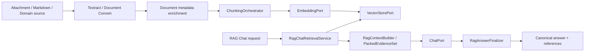

# AI/RAG 아키텍처 가이드

Studio One의 AI/RAG 기능을 처음 구성하거나 변경할 때 사용하는 문서 진입점이다.
이 문서는 모듈 경계와 전체 실행 흐름을 설명한다. 세부 설정값과 전체 HTTP 계약은 각 스타터
README를 기준으로 하며, 같은 설정을 이 문서에 중복 정의하지 않는다.

## 먼저 읽을 문서

| 목적 | 문서 |
|---|---|
| 문서 색인 흐름과 재색인 기준 | [RAG 색인](indexing.md) |
| 근거 기반 답변·인용·SSE 계약 | [근거 기반 RAG Chat](grounded-chat.md) |
| 기동·진단·캐시·장애 대응 | [운영 및 문제 해결](operations.md) |
| AI 공통 타입과 metadata key | [studio-platform-ai](../../studio-platform-ai/README.md) |
| Provider·벡터·RAG runtime 설정 | [studio-platform-starter-ai](../../starter/studio-platform-starter-ai/README.md) |
| HTTP API와 권한 | [studio-platform-starter-ai-web](../../starter/studio-platform-starter-ai-web/README.md) |
| 청킹 전략과 설정 | [studio-platform-starter-chunking](../../starter/studio-platform-starter-chunking/README.md) |

## 모듈 책임 지도

| 영역 | 소유 모듈 | 담당하는 것 | 담당하지 않는 것 |
|---|---|---|---|
| AI 공통 계약 | `studio-platform-ai` | Chat, embedding, vector, RAG, job, metadata key 계약 | Spring AI adapter, HTTP controller |
| 모델 정의 | `studio-platform-ai-model-catalog` | 모델 capability와 workload 카탈로그 | 운영 deployment와 secret |
| 모델 배포 | `studio-platform-starter-ai` | `ModelDeploymentRegistry`, provider adapter, 기본 포트 선택 | 서버별 API key 관리 |
| RAG runtime | `studio-platform-starter-ai` | `DefaultRagPipelineService`, pgvector adapter, job service | 파일 추출, HTTP 노출 |
| AI/RAG HTTP | `studio-platform-starter-ai-web` | Chat/RAG API, 검색 orchestration, 근거 패킹, 인용 검증, SSE, answer cache | 문서 파싱, 청킹 구현 |
| 청킹 계약 | `studio-platform-chunking` | chunk, normalized document, provenance, context expansion 계약 | 전략 구현과 Spring 설정 |
| 청킹 구현 | `studio-platform-chunking-runtime` | recursive, fixed, token, structure, blockify, context expander | REST API, vector 저장 |
| 청킹 자동 구성 | `studio-platform-starter-chunking` | runtime Bean과 `studio.chunking.*` 설정 | 문서 추출, embedding |
| 문서 메타데이터 | `studio-platform-document-metadata` | 의미 유형, schema, artifact, provenance, projection allowlist | 저장소, LLM 호출, HTTP |
| Markdown 계약 | `studio-platform-markdown` | 문서/revision/pipeline/resource 저장 계약과 API | 추출기·AI runtime 구현 |
| Markdown runtime | `studio-platform-starter-markdown` | native metadata, 조건부 LLM enrichment, backfill, RAG 연결 | Provider 모델 카탈로그 |
| 첨부 연동 | `content-embedding-pipeline` | Attachment 추출, 구조화 색인, attachment job executor | 범용 AI/RAG 계약 |

## 전체 구조



색인과 답변은 같은 metadata와 object scope를 공유하지만 별도 실행 흐름이다.
문서 처리 프로필과 의미 유형은 metadata·질의 라우팅에 사용하며, 의미 유형만으로 청킹 전략을
자동 변경하지 않는다.

## 색인 흐름

1. source adapter가 원문을 정규화하고 `objectType`, `objectId`, revision과 locator를 보존한다.
2. Markdown 경로는 `METADATA_ENRICHMENT`에서 native·구조 기반 metadata를 먼저 생성한다.
3. `ChunkingOrchestrator`가 설정된 전략과 단위로 chunk를 생성한다.
4. `EmbeddingPort`가 deployment에 맞는 embedding을 생성한다.
5. `VectorStorePort`가 embedding identity, object scope, chunk provenance를 저장한다.
6. 재색인은 같은 object scope의 오래된 chunk가 남지 않도록 replace/delete 후 저장한다.

세부 동작과 structured/fallback 경계는 [RAG 색인](indexing.md)을 따른다.

## 근거 기반 답변 흐름

1. `ChatController`가 권한과 object scope를 확인한다.
2. 질의 의도를 분류하고 metadata 조회 또는 semantic retrieval 경로를 선택한다.
3. `RagChatRetrievalService`가 검색 결과와 주변 문맥을 수집한다.
4. `RagContextBuilder`가 prompt 한도 안에서 근거를 패킹한다.
5. `PackedEvidenceSet`이 prompt context, 번호순 evidence, source span과 fingerprint의 단일 원본이 된다.
6. Provider draft를 `RagCitationValidator`와 `RagAnswerFinalizer`가 검증한다.
7. sync 응답과 SSE `complete`는 같은 canonical content와 reference를 반환한다.

packed evidence가 없거나 citation이 구조적으로 유효하지 않으면 근거 부족 응답을 반환하며,
검증되지 않은 draft를 대화 메모리나 exact-answer cache에 저장하지 않는다.

## 최소 조합

### 일반 채팅

```kotlin
implementation(project(":starter:studio-platform-starter-ai"))
implementation(project(":starter:studio-platform-starter-ai-web"))
implementation("org.springframework.ai:spring-ai-starter-model-openai")
```

Chat deployment와 provider 설정만 필요하다. 벡터 저장소가 없으면 RAG·vector 기능은 사용할 수 없다.

### 범용 RAG

```kotlin
implementation(project(":starter:studio-platform-starter-ai"))
implementation(project(":starter:studio-platform-starter-ai-web"))
implementation(project(":starter:studio-platform-starter-chunking"))
implementation("org.springframework.ai:spring-ai-starter-model-openai")
```

PostgreSQL/pgvector와 `JdbcTemplate`을 준비하고 CHAT과 EMBEDDING deployment를 각각 등록한다.

### 첨부파일 RAG

```kotlin
implementation(project(":starter:studio-application-starter-attachment"))
implementation(project(":studio-application-modules:content-embedding-pipeline"))
implementation(project(":starter:studio-platform-textract-starter"))
implementation(project(":starter:studio-platform-starter-chunking"))
implementation(project(":starter:studio-platform-starter-ai-web"))
```

파일 추출과 attachment object 권한이 추가로 필요하다.

### Markdown 지식 파이프라인

```kotlin
implementation(project(":starter:studio-platform-starter-markdown"))
implementation(project(":starter:studio-platform-starter-chunking"))
implementation(project(":starter:studio-platform-starter-ai-web"))
```

`studio-platform-starter-markdown`은 revision, metadata enrichment, ChunkSet/RAG 후속 실행을 연결한다.
실제 변환·추출·provider 의존성은 사용하는 포맷과 모델에 맞게 소비 서버가 추가한다.

## 설정 소유권

| Namespace | 소유 영역 |
|---|---|
| `spring.ai.*` | Provider SDK 연결과 모델별 native option |
| `studio.ai.providers.*` | Studio provider 등록과 channel 활성화 |
| `studio.ai.deployments.*` | 논리 deployment와 모델 카탈로그 연결 |
| `studio.ai.routing.*` | 기본 chat/embedding provider 호환 설정 |
| `studio.ai.rag.*` | RAG pipeline, retrieval, job, answer cache |
| `studio.ai.endpoints.*` | 사용자·관리 HTTP API |
| `studio.chunking.*` | 청킹 전략, 크기, tokenizer, blockify |
| `studio.markdown.*` | Markdown 변환, metadata enrichment와 후속 pipeline |

서버에는 논리 deployment ID와 secret reference를 두고 모델 capability는 공통 모델 카탈로그에서 관리한다.
Provider base URL, credential, 내부 topology는 사용자 응답이나 운영 로그에 노출하지 않는다.

## 변경 시 확인할 계약

- 인덱싱과 검색은 동일한 embedding deployment, dimension, input type을 사용한다.
- `objectType`/`objectId`는 API, vector metadata, 권한 router에서 같은 의미를 가진다.
- prompt context와 API reference는 같은 `PackedEvidenceSet`에서 생성한다.
- exact excerpt는 인덱싱된 정규화 chunk의 연속 부분 문자열이어야 한다.
- SSE draft는 확정 답변이 아니며 `complete.canonicalContent`가 최종 계약이다.
- cache hit도 현재 검색 결과로 reference와 citation을 다시 검증한다.
- metadata prompt fact에는 source-verified field만 사용한다.
