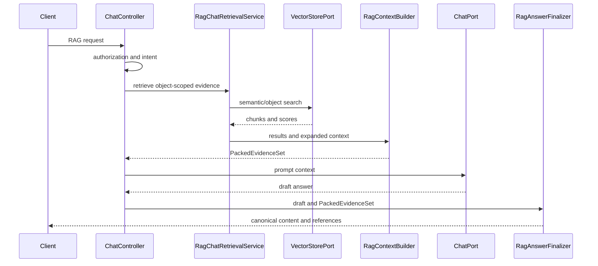

# 근거 기반 RAG Chat

RAG Chat의 목표는 검색 결과를 단순히 prompt에 붙이는 것이 아니라, 답변과 API reference가 동일한
원문 구간을 가리키도록 보장하는 것이다.

## 실행 흐름

## `PackedEvidenceSet`

`PackedEvidenceSet`은 응답 단위의 단일 근거 원본이다.

- `promptContext`: 실제 모델에 전달하는 context
- `evidence[]`: 1부터 시작하는 citation 순서
- `sourceSpans[]`: exact text와 locator
- `diagnostics`: 패킹 결과와 제외 사유
- `contextFingerprint`: cache와 응답 일관성 확인값

각 evidence는 안정적인 `evidenceId`, document/revision/chunk ID, score, evidence kind,
support status와 source span을 가진다. reference는 이 집합에서만 생성한다.

`exactText`는 원본 binary byte 구간이 아니라 인덱싱된 정규화 chunk 안의 연속 부분 문자열이다.
source span이 packed content에 존재하지 않으면 reference span으로 채택하지 않는다.

## 질의 경로

| 질의 | 기본 경로 |
|---|---|
| 제목·저자·소속·발간일·ISBN·DOI | source-verified document metadata |
| 특정 사실·문장 | object-scoped semantic retrieval |
| 전체 요약·줄거리 | overview 또는 map-reduce |
| 해석·비교 | 복수 근거 retrieval 후 evidence-based inference |

자동 감지한 문서 의미 유형만으로 검색 결과를 배제하지 않는다. 사용자가 명시한 필터 또는 object scope가
있을 때만 hard filter를 적용한다.

## 인용 검증과 canonical 응답

`RagCitationValidator`는 답변의 citation 번호가 packed evidence 범위 안에 있는지 확인한다.
유효한 번호라는 사실은 의미적 사실 검증과 같지 않다.

| 상태 | 의미 |
|---|---|
| `INDEX_VALID` | citation 번호와 packed evidence 구조가 유효함 |
| `MISSING_CITATION` | 근거가 있지만 답변에 citation이 없음 |
| `OUT_OF_RANGE` | packed evidence 범위 밖 citation이 있음 |
| `NO_PACKED_EVIDENCE` | 모델에 전달할 근거가 없음 |

근거가 없거나 구조적으로 유효하지 않은 답변은 `RagAnswerFinalizer`가 안전한 근거 부족 응답으로 교체한다.
기본 경로는 두 번째 LLM repair를 호출하지 않는다.

`supportStatus=SOURCE_VERIFIED`는 원문 span의 provenance를 뜻한다. citation 번호가 유효하다는 이유만으로
모델이 작성한 모든 문장을 `SOURCE_VERIFIED`로 승격하지 않는다.

## Sync와 SSE

동기 API와 SSE는 같은 retrieval, `PackedEvidenceSet`, finalizer를 사용한다.

- SSE `delta`는 draft이며 citation 링크를 확정하지 않는다.
- `complete.canonicalContent`가 최종 표시·저장 대상이다.
- `complete.metadata.ragReferences`는 canonical content에 대응하는 검증된 reference다.
- 대화 메모리에는 draft가 아니라 canonical content만 저장한다.

클라이언트는 스트리밍이 완료되면 누적 draft를 `canonicalContent`로 교체해야 한다.

## Answer cache

exact-answer cache는 authorization과 현재 retrieval/packing 이후에 조회한다.
key에는 principal, object scope, 질문/대화, deployment, retrieval 설정과 evidence fingerprint가 포함된다.

cache hit도 현재 `PackedEvidenceSet`으로 citation을 재검증하고 reference를 다시 만든다.
cached payload에는 credential, 원문 전체, locator/reference 전체를 저장하지 않는다.

## Reference 표시 권장

클라이언트는 citation 번호만 표시하지 말고 다음 값을 함께 보여준다.

- 문서 제목 또는 원본 파일명
- exact excerpt
- page, slide, section, sourceRef
- score
- support status
- truncated 여부

raw vector metadata map이나 내부 provider topology는 사용자에게 노출하지 않는다.

## 관련 API

- `POST /api/ai/chat/rag`
- `POST /api/ai/chat/rag/stream`
- `GET /api/mgmt/ai/rag/objects/{objectType}/{objectId}/chunks`
- `GET /api/mgmt/ai/rag/objects/{objectType}/{objectId}/metadata`

전체 endpoint와 권한은
[AI Web README](../../starter/studio-platform-starter-ai-web/README.md#3-rest-엔드포인트)를 따른다.
