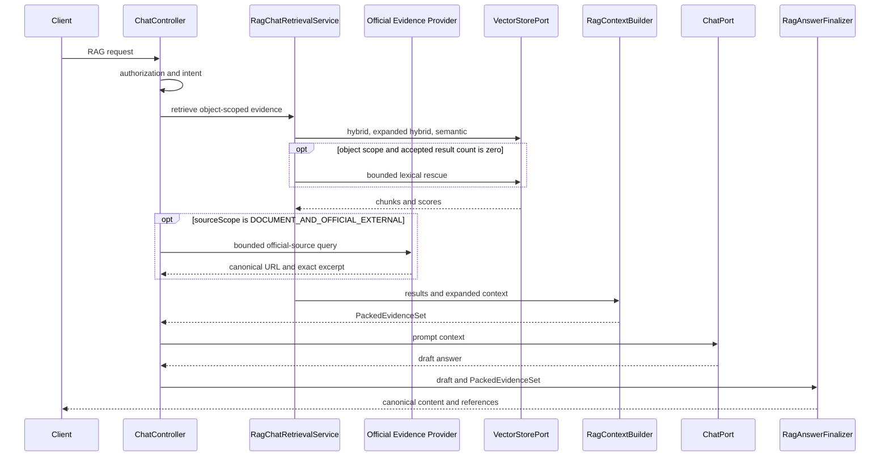

# 근거 기반 RAG Chat

RAG Chat의 목표는 검색 결과를 단순히 prompt에 붙이는 것이 아니라, 답변과 API reference가 동일한
원문 구간을 가리키도록 보장하는 것이다.

## 실행 흐름



## `PackedEvidenceSet`

`PackedEvidenceSet`은 응답 단위의 단일 근거 원본이다.

- `promptContext`: 실제 모델에 전달하는 context
- `evidence[]`: 1부터 시작하는 citation 순서
- `sourceSpans[]`: exact text와 locator
- `diagnostics`: 패킹 결과와 제외 사유
- `contextFingerprint`: cache와 응답 일관성 확인값

각 evidence는 안정적인 `evidenceId`, document/revision/chunk ID, score, evidence kind,
support status와 source span을 가진다. reference는 이 집합에서만 생성한다.

`exactText`는 원본 binary byte 구간이 아니라 인덱싱된 정규화 chunk 안의 연속 부분 문자열이다.
source span이 packed content에 존재하지 않으면 reference span으로 채택하지 않는다.

## 질의 경로

| 질의 | 기본 경로 |
|---|---|
| 제목·저자·소속·발간일·ISBN·DOI | source-verified document metadata |
| 특정 사실·문장 | object-scoped semantic retrieval |
| 전체 요약·줄거리 | overview 또는 map-reduce |
| 해석·비교 | 복수 근거 retrieval 후 evidence-based inference |

자동 감지한 문서 의미 유형만으로 검색 결과를 배제하지 않는다. 사용자가 명시한 필터 또는 object scope가
있을 때만 hard filter를 적용한다.

객체 범위 검색은 `hybrid → keyword-expanded hybrid → semantic → object lexical rescue` 순서를 사용한다.
각 단계는 `minScore` 적용 후 결과가 있을 때만 성공으로 종료한다. 마지막 lexical rescue는
`objectType`과 `objectId`가 모두 존재할 때만 실행하며, 동일 객체의 인덱싱된 정규화 chunk에서 질의 핵심어가
실제로 확인되고 embedding metadata filter가 일치하는 결과만 반환한다. 답변 모드는 이 검색 순서와 결과를
변경하지 않는다.

동일한 논리 embedding deployment와 차원을 사용한 기존 색인의 fingerprint만 변경된 경우에는 벡터 유사도
계산을 수행하지 않는 lexical rescue에 한해 exact-match 원문 후보를 사용할 수 있다. 서로 다른 deployment나
차원의 색인은 혼합하지 않는다. 문맥 확장으로 previous/next 구간을 포함하더라도 공개 근거의 첫 발췌는 검색
seed 구간을 우선한다. 길이 제한이 적용되면 seed를 포함하는 연속 구간을 패킹하고 source span offset을
다시 계산한다. lexical rescue에서 실제 적중한 질의어가 있으면 공개 발췌는 그 주변의 exact substring을
최대 500자로 제공하며 적중 질의어 자체는 공개 계약에 노출하지 않는다.

legacy vector row가 동일한 문서 ID를 공유하는 경우에는 `_vectorRowId`를 내부 chunk identity로 사용해
검색 seed와 이웃 chunk를 구분한다. 해석형 답변은 직접 사실과 해석을 구분한 단일 문단으로 작성하고 각 문장
끝에 인용을 둔다. 이는 검색 범위를 바꾸는 규칙이 아니라 장문의 무인용 보조 문단이 최종 검증에서 탈락하는
경우를 줄이기 위한 출력 계약이다.

## 답변 범위와 자료 범위

답변 허용 수준과 검색 자료의 범위는 독립적으로 선택한다.

| 계약 | 값 | 의미 |
|---|---|---|
| `answerMode` | `STRICT_GROUNDED` | 문서 또는 공식 원문에 직접 나타난 사실만 답변 |
| `answerMode` | `GROUNDED_INFERENCE` | 근거에서 가능한 해석을 사실과 구분해 답변 |
| `sourceScope` | `DOCUMENT_ONLY` | 현재 object scope에 색인된 문서만 사용 |
| `sourceScope` | `DOCUMENT_AND_OFFICIAL_EXTERNAL` | 문서와 서버가 승인한 공식 외부자료를 비교 |

외부자료 범위는 일반 인터넷 지식이나 모델 사전지식을 허용하는 모드가 아니다.
`ExternalEvidenceProvider`는 공식 원문의 canonical HTTPS URL, 발행기관, 기준일과 원문 exact excerpt를
반환해야 한다. 서버는 승인된 gateway/source host만 허용하며 검색 snippet은 검증 근거로 사용하지 않는다.
문서와 외부자료가 모두 패킹된 비교 답변은 두 origin을 모두 인용해야 한다. 어느 한쪽 인용이 빠지면
`MISSING_COMPARISON_SOURCE_CITATION`으로 canonical 답변을 거부한다.

`GET /api/ai/chat/rag/capabilities`는 현재 사용 가능한 answer mode와 source scope, 기본값, 서버 상한,
provider 가용성을 함께 반환한다. provider가 없거나 비활성화된 경우 외부자료 요청은
`DOCUMENT_ONLY`로 축소되며 그 사유가 `sourcePolicy` metadata에 표시된다.

## 사전 수집 웹 자료

공개 HTTPS 페이지는 workspace 범위의 `web_source`로 등록할 수 있다. 서버는 redirect를 포함한
모든 주소의 공인 IP 여부, MIME, 크기, timeout과 robots 정책을 확인한 뒤 정제 본문만 저장하고 기존
chunking·embedding·vector pipeline으로 색인한다. 로그인·쿠키·사용자 header와 JavaScript 렌더링은
지원하지 않는다. 공인 주소 검증은 실제 HTTP connection의 DNS resolver에서 수행되며, 외부 본문과
표시 metadata의 직접 연락처·정부·결제 식별자는 저장·청킹 전에 마스킹한다.

```http
POST /api/workspaces/{workspaceId}/ai/rag/web-sources
Content-Type: application/json

{
  "url": "https://example.org/article",
  "displayName": "참고 자료",
  "embeddingDeploymentId": "humanities-text-v1"
}
```

`COMPLETED` revision은 RAG 요청의 `indexedWebSources`에 최대 10개까지 고정한다. revision을 명시하지
않거나 workspace 권한·embedding space가 맞지 않으면 요청을 거부한다.

```json
{
  "indexedWebSources": [
    {"sourceId": "wsrc-...", "revisionId": "wrev-..."}
  ]
}
```

사전 수집 자료의 origin은 `INDEXED_WEB`, 공식 실시간 provider 자료는 `OFFICIAL_EXTERNAL`이다.
일반 질문은 관련도가 높은 한쪽 근거만으로 답변할 수 있다. 문서와 외부 자료의 비교 요청은
`DOCUMENT`와 외부 origin이 모두 packing되고 최종 답변에서도 양쪽을 인용해야 하며, 부족하면
`EVIDENCE_ONLY / INSUFFICIENT_SOURCE_COVERAGE`를 반환한다. URL source refresh는 새 revision을 만들고
선택 fingerprint가 달라지므로 이전 exact cache와 대화 근거를 재사용하지 않는다.

PII redaction은 기본 활성화다. 규제·호환성 검토를 거친 명시적 환경에서만 설정을 변경한다.

```yaml
studio:
  ai:
    indexed-web:
      content-security:
        pii-redaction-enabled: true
```

클라이언트는 embedding deployment를 profile/provider/model 이름에서 추정하거나
`embedding-default`로 자동 대체하지 않는다. canonical deployment ID가 없으면 URL source 등록과
선택을 비활성화한다. 자세한 구현 기준은
[`client-indexed-web-rag-integration-guide.md`](../plans/client-indexed-web-rag-integration-guide.md)를
참조한다.

## 인용 검증과 canonical 응답

`RagCitationValidator`는 답변의 citation 번호가 packed evidence 범위 안에 있는지 확인한다.
유효한 번호라는 사실은 의미적 사실 검증과 같지 않다.

| 상태 | 의미 |
|---|---|
| `INDEX_VALID` | citation 번호와 packed evidence 구조가 유효함 |
| `MISSING_CITATION` | 근거가 있지만 답변에 citation이 없음 |
| `OUT_OF_RANGE` | packed evidence 범위 밖 citation이 있음 |
| `NO_PACKED_EVIDENCE` | 모델에 전달할 근거가 없음 |

최종 결과는 `ragAnswerOutcome`으로 구분한다.

| type | 의미 |
|---|---|
| `ANSWERED` | 인용 구조 검증을 통과한 canonical 답변 |
| `EVIDENCE_ONLY` | 검색·패킹 근거는 있지만 생성 답변이 인용 검증에 실패하여 원문 후보만 제공 |
| `ABSTAINED` | 검색, 패킹 또는 사용 가능한 원문 span이 없어 답변하지 않음 |

`EVIDENCE_ONLY`에서는 생성 draft를 폐기하고 `SOURCE_VERIFIED` exact excerpt를 최대 3개, 각 500자
이하로 반환한다. 검색 0건, packing 0건, 인용 실패는 각각 다른 `stage`와 `reasonCode`를 사용한다.
기본 경로는 두 번째 LLM repair를 호출하지 않는다.

학자·연구자·인물 목록 질의는 `FACTUAL_LIST`로 분류하고 각 목록 항목에 한 명과 인용을 요구한다.
`factual-list-partial-answer-enabled=true`인 경우 순수 목록의 인용 없는 항목만 제거한 뒤 남은
canonical 목록을 동일한 validator로 다시 검증할 수 있다. 이 경로는 citation이 `INDEX_VALID`이고
실패 원인이 `MISSING_UNIT_CITATION`뿐일 때만 사용한다. 범위 밖 citation, 서술형 문단, 표와 코드
블록에는 적용하지 않는다. 부분 결과는 `type=ANSWERED`, `partial=true`,
`omittedValidationUnitCount`로 표시한다.

`supportStatus=SOURCE_VERIFIED`는 원문 span의 provenance를 뜻한다. citation 번호가 유효하다는 이유만으로
모델이 작성한 모든 문장을 `SOURCE_VERIFIED`로 승격하지 않는다.

## Sync와 SSE

동기 API와 SSE는 같은 retrieval, `PackedEvidenceSet`, finalizer를 사용한다.

- RAG SSE는 검색·생성 상태만 실시간으로 전송하고 검증 전 답변 `delta`는 공개하지 않는다.
- `complete.canonicalContent`가 유일한 최종 표시·저장 대상이다.
- `complete.metadata.ragReferences`는 canonical content에 대응하는 검증된 reference다.
- 대화 메모리에는 draft가 아니라 canonical content만 저장한다.

클라이언트는 `complete` 전에는 답변과 citation을 표시하지 않는다.

## Answer cache

exact-answer cache는 authorization과 현재 retrieval/packing 이후에 조회한다.
key에는 principal, object scope, 질문/대화, deployment, retrieval 설정과 evidence fingerprint가 포함된다.

cache hit도 현재 `PackedEvidenceSet`으로 citation을 재검증하고 reference를 다시 만든다.
cached payload에는 credential, 원문 전체, locator/reference 전체를 저장하지 않는다.

## Reference 표시 권장

클라이언트는 citation 번호만 표시하지 말고 다음 값을 함께 보여준다.

- 문서 제목 또는 원본 파일명
- exact excerpt
- page, slide, section과 정제된 locator
- raw 검색 score
- support status
- truncated 여부

내부 document/revision/chunk ID, raw `sourceRef`, fingerprint, raw vector metadata map이나 provider
topology는 사용자에게 노출하지 않는다.

## 관련 API

- `POST /api/ai/chat/rag`
- `POST /api/ai/chat/rag/stream`
- `GET /api/ai/chat/rag/capabilities`
- `GET /api/mgmt/ai/rag/objects/{objectType}/{objectId}/chunks`
- `GET /api/mgmt/ai/rag/objects/{objectType}/{objectId}/metadata`

전체 endpoint와 권한은
[AI Web README](../../starter/studio-platform-starter-ai-web/README.md#3-rest-엔드포인트)를 따른다.
