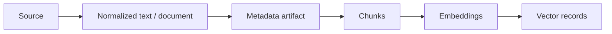

# RAG 색인

이 문서는 원문이 검색 가능한 chunk와 vector record로 변환되는 흐름, 경로별 차이와 재색인 기준을
설명한다. 청킹 전략별 세부 설정은
[starter-chunking README](../../starter/studio-platform-starter-chunking/README.md)를 기준으로 한다.

## 공통 색인 단계



| 단계 | 주요 계약 | 필수 보존값 |
|---|---|---|
| 정규화 | `NormalizedDocument`, Markdown revision | source/revision, locator, block |
| 메타데이터 | `DocumentMetadataArtifact` | semantic type, provenance, evidence |
| 청킹 | `ChunkingOrchestrator` | chunk ID/order, parent/neighbor, source span |
| 임베딩 | `EmbeddingPort` | deployment, model, dimension, input type |
| 저장 | `VectorStorePort`, `VectorRecord` | object scope, content hash, embedding identity |

`DefaultRagPipelineService`는 범용 text 색인을 제공한다. attachment와 Markdown은 source 고유의
정규화·revision 정보를 보존하기 위해 별도 adapter를 사용하고, 최종 embedding/vector 계약은 동일하게 맞춘다.

## 범용 text 색인

`RagPipelineService.index(...)`는 text 정제, chunking, embedding, vector 저장을 순서대로 수행한다.
`ChunkingOrchestrator`가 있으면 이를 우선하고 없으면 legacy `TextChunker`를 사용한다.

새로운 소비 모듈은 다음 값을 명시해야 한다.

- 안정적인 `documentId`
- 권한과 검색 범위를 나타내는 `objectType`, `objectId`
- 사용할 embedding deployment 또는 profile
- 원문 변경을 식별할 revision/content hash
- UI 근거 표시에 필요한 `sourceRef`, page/section/block locator

## 첨부파일 색인

`content-embedding-pipeline`의 `AttachmentRagIndexService`가 attachment source를 실행한다.

1. `AttachmentService`가 파일 stream과 source 정보를 제공한다.
2. `FileContentExtractionService`가 text 또는 구조화 문서를 생성한다.
3. `TextractNormalizedDocumentAdapter`, `ChunkingOrchestrator`, `EmbeddingPort`,
   `VectorStorePort`가 모두 있으면 구조화 색인을 사용한다.
4. 선택 Bean이 부족하면 `RagPipelineService.index(...)` text 경로로 fallback한다.
5. 대용량 문서는 chunk를 batch upsert해 전체 embedding 목록을 메모리에 보관하지 않는다.

구조화 경로와 fallback 경로는 요청의 embedding 선택과 object scope를 동일하게 전달해야 한다.
상세 API는
[Content Embedding Pipeline](../../studio-application-modules/content-embedding-pipeline/README.md)을
참고한다.

## Markdown 색인

Markdown pipeline의 명시적 순서는 다음과 같다.

1. `METADATA_ENRICHMENT`
2. `CHUNKING`
3. `RAG_INDEX`
4. 선택적 `SKILL_EXTRACTION`

metadata enrichment는 native/구조 기반 값을 우선한다. `AUTO` 모드에서는 신뢰도가 낮거나 필드가
부족한 경우에만 structured-output CHAT deployment를 호출한다. metadata 실패 정책은
`OFF | AUTO | REQUIRED`로 구분한다.

현재 revision의 normalized snapshot을 기준으로 처리하며, metadata artifact는 revision별 typed resource로
저장한다. 전체 artifact를 각 chunk에 반복 저장하지 않고 vector에는 projection allowlist만 저장한다.

## 청킹 선택

기본 청킹 계약은 다음과 같다.

```yaml
studio:
  chunking:
    strategy: recursive
    unit: character
    max-size: 800
    overlap: 100
```

문서 처리 프로필, 문서 의미 유형, Blockify 문서 유형은 서로 다른 값이다.

- 처리 프로필: extraction/chunking 요청 preset
- 의미 유형: metadata schema와 metadata 질의 라우팅
- Blockify 유형: block 생성 prompt/profile 선택

의미 유형을 자동 감지했다는 이유만으로 청킹 전략을 변경하거나 검색 결과를 hard filter하지 않는다.

## Embedding identity

색인과 검색에서 아래 값이 일치해야 한다.

- embedding deployment ID
- provider와 model reference
- dimension
- embedding purpose/input type
- embedding space 또는 profile ID

명시한 deployment를 찾지 못했을 때 다른 모델로 조용히 대체하지 않는다. 기존 record에 model identity가
불완전한 경우 `unknown`을 새로 추정해 쓰거나 자동 재임베딩하지 않는다.

## 재색인과 metadata backfill

| 작업 | Chunk 변경 | Embedding 변경 | 사용 시점 |
|---|---:|---:|---|
| metadata backfill | 아니오 | 아니오 | 기존 revision에 metadata artifact/projection 보강 |
| RAG reindex | 예 | 예 | 원문·청킹·embedding deployment 변경 |
| metadata-only vector patch | 아니오 | 아니오 | 기존 index의 compact metadata 갱신 |

backfill은 normalized snapshot이 있는 현재 완료 revision만 대상으로 한다. revision 또는 content hash가
바뀌면 건너뛰며, index가 없던 문서에 새 index를 만들지 않는다.

## 색인 완료 확인

- RAG job이 `COMPLETED` 또는 허용된 warning 상태인지 확인한다.
- chunk 수와 vector 수가 기대 범위인지 확인한다.
- 첫 chunk와 마지막 chunk의 locator/sourceRef를 확인한다.
- vector metadata에 object scope와 canonical embedding identity가 있는지 확인한다.
- 같은 object를 다시 색인한 뒤 stale chunk가 검색되지 않는지 확인한다.
- attachment/Markdown 상세 조회가 현재 revision을 가리키는지 확인한다.
