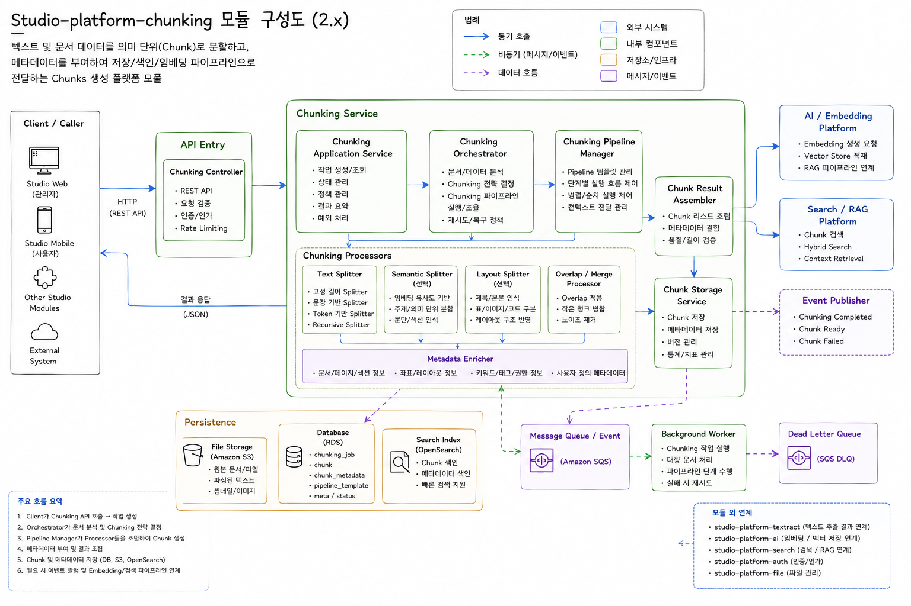

# Studio Platform Chunking


텍스트 및 문서 데이터를 의미 단위(Chunk)로 분할하고, 메타데이터를 부여하여 저장·검색·임베딩·RAG(Retrieval-Augmented Generation) 파이프라인에서 효율적으로 활용할 수 있도록 지원하는 Chunk 생성 플랫폼 모듈이다. 이 모듈은 단순 문자열 분할을 넘어 문서 구조와 의미를 고려한 Semantic Chunking 및 Layout-aware Chunking을 지원하며, AI 기반 검색과 문맥(Context) 유지 성능 향상을 목표로 설계되었다.

외부 시스템 또는 상위 서비스는 REST API를 통해 Chunking 작업을 요청하며, API Entry 계층의 ChunkingController는 요청 검증, 인증/인가, Rate Limiting 등을 수행한 후 Chunking Application Service로 작업을 전달한다. Chunking Application Service는 작업 생성, 상태 관리, 정책 처리, 예외 처리 등을 담당하며, 전체 Chunk 생성 프로세스를 제어한다.

이후 Chunking Orchestrator는 입력 문서와 텍스트를 분석하여 적절한 Chunking 전략을 결정한다. 문서 유형, 텍스트 길이, 문맥 구조 등을 기반으로 Chunking Pipeline을 선택하며, Chunking Pipeline Manager는 실제 Chunk 생성 흐름과 단계별 Processor 실행을 조합·제어한다.

Chunk 생성은 여러 종류의 Chunking Processor를 통해 수행된다. Text Splitter는 고정 길이, 문장 기반, Token 기반, Recursive Splitter 등의 일반적인 텍스트 분할 전략을 제공한다. Semantic Splitter는 임베딩 기반 의미 분석을 활용하여 문맥 및 주제 단위로 텍스트를 분할하며, Layout Splitter는 제목·본문·표·이미지·코드 블록 등 문서 레이아웃 구조를 고려한 Chunk 분리를 지원한다. 또한 Overlap / Merge Processor는 Chunk 간 문맥 유지와 검색 정확도 향상을 위해 Overlap 영역 생성 및 노이즈 제거를 수행한다.

생성된 Chunk는 Metadata Enricher를 통해 문서명, 페이지, 섹션, 레이아웃 정보, 키워드, 태그, 관계 정보 등 다양한 메타데이터가 부여된다. 이후 Chunk Result Assembler는 Chunk 리스트를 조립하고 품질·길이 검증을 수행하여 최종 결과를 구성한다.

완성된 Chunk는 Chunk Storage Service를 통해 저장되며, 원본 문서는 File Storage(S3/Object Storage)에 저장되고, Chunk 및 메타데이터는 Database(RDS)에 관리된다. 또한 Search Index(OpenSearch)에는 검색용 색인이 생성되어 빠른 검색과 RAG 기반 Context Retrieval을 지원한다. 필요 시 AI/Embedding Platform과 연동하여 벡터 생성 및 Vector Store 적재가 수행된다.

대용량 문서 또는 장시간 Chunking 작업은 Message Queue(SQS 등)와 Background Worker를 기반으로 비동기 처리되며, 실패 작업은 Dead Letter Queue(DLQ)로 이동하여 안정적인 운영과 재처리를 지원한다. 작업 완료 후에는 Event Publisher를 통해 Chunk 생성 완료 이벤트가 발행되어 상위 AI/RAG 시스템과 연계된다.

최종적으로 studio-platform-chunking 모듈은 단순 텍스트 분할 기능을 넘어, AI 기반 검색, Semantic Retrieval, Hybrid Search, Context-aware RAG, Skill Extraction 등의 상위 AI 기능을 지원하기 위한 핵심 전처리 플랫폼 역할을 수행하며, 향후 Layout-aware RAG, 멀티모달 Chunking, Skill 기반 Chunk Tagging, 학습 콘텐츠 Semantic 분석 등으로 확장 가능한 구조를 목표로 한다.

`studio-platform-chunking`은 AI/RAG 색인을 위한 provider-neutral chunking 계약 모듈입니다.


## 책임 범위

- 불변 chunking 요청/결과 모델을 정의합니다.
- 전략 중립적인 chunking 확장 지점을 정의합니다.
- 검색용 child chunk와 context 복구용 parent 관계를 모델링합니다.
- Spring, AI provider SDK, JDBC, vector store 구현에 의존하지 않습니다.
- embedding API 호출, vector DB 저장, LLM 호출, OCR 실행, 파일 parser 실행을 하지 않습니다.

## 핵심 타입

- `Chunker`: chunking 전략 구현 계약입니다.
- `ChunkingOrchestrator`: 전략 선택과 조합 계약입니다.
- `ChunkingContext`: 텍스트 chunking 입력 컨텍스트입니다.
- `Chunk`: chunk content와 metadata를 담는 불변 결과입니다.
- `ChunkMetadata`: vector indexing 전에 보존할 표준 metadata입니다.
- `ChunkType`: `child`, `parent`, `table`, `ocr` 등 chunk 역할입니다.
- `ChunkingStrategyType`: 지원 전략 식별자입니다.
- `ChunkUnit`: character/token 기준 size 단위입니다.
- `NormalizedDocument`: parser에 독립적인 구조화 문서 입력입니다.
- `NormalizedBlock`: parser에 독립적인 논리 block과 provenance입니다.
- `NormalizedDocumentChunker`: normalized document chunking 확장 계약입니다.
- `ChunkContextExpander`: 검색된 child chunk를 답변 context로 확장하는 계약입니다.
- `ChunkContextExpansionRequest` / `ChunkContextExpansion`: context expansion 요청/결과 모델입니다.

## Metadata 규칙

- metadata map은 defensive copy 됩니다.
- null key, blank key, null value, blank string value는 제거됩니다.
- `chunkOrder`는 Phase 1 호환성을 위한 canonical persisted order key로 유지됩니다.
- `ChunkMetadata.order`는 downstream 저장 시 `chunkOrder`와 같은 값으로 매핑되는 것을 전제로 합니다.
- 구조화 provenance key는 downstream 소비자를 위해 표준화합니다.
- parent-child 관계 key는 additive metadata이며 기존 key를 대체하지 않습니다.
- `parentId`는 legacy compatibility 용도로 유지하며 `parentChunkId`와 다른 의미입니다.
- vector storage와 retrieval에서 소비하는 통합 기준은
  [`studio-platform-ai` RAG metadata key reference](../studio-platform-ai/README.md#rag-metadata-key-reference)를 따릅니다.

### Metadata Key Reference

| Key | 목적 | 호환성 |
| --- | --- | --- |
| `sourceDocumentId` | 생성된 chunk를 원본 문서 단위로 묶는 식별자입니다. | 기존 key |
| `parentId` | legacy parent 식별자입니다. `parentChunkId`와 의미가 다릅니다. | 기존 key |
| `chunkOrder` | 저장/정렬용 chunk 순서입니다. | 기존 key, order 기준 유지 |
| `strategy` | `recursive`, `structure-based` 등 chunking 전략입니다. | 기존 key |
| `chunkType` | `child`, `parent`, `table`, `ocr`, `image-caption` 등 검색 역할입니다. | 추가 key |
| `parentChunkId` | child chunk가 속한 deterministic parent section id입니다. | 추가 key, `parentId`와 별도 |
| `parentChunkContent` | 답변 시 parent context 복구에 사용할 저장된 section content입니다. | 추가 key |
| `previousChunkId` / `nextChunkId` | 같은 parent section 안의 인접 child chunk 링크입니다. | 추가 key |
| `sourceRef` / `sourceRefs` | parser/source provenance 참조입니다. | 추가 key |
| `blockType`, `blockIds`, `parentBlockId` | 구조화 추출 block identity와 hierarchy입니다. | 추가 key |
| `page`, `slide`, `headingPath`, `sourceFormat` | 위치와 section context입니다. | 추가 key |
| `confidence` | parser/OCR confidence가 있는 경우 보존합니다. | 추가 key |
| `tokenEstimate`, `chunkUnit`, `maxSize`, `overlap` | size 정책과 검증 evidence입니다. | 추가 key |

## 구조화 입력

`NormalizedDocument`와 `NormalizedBlock`은 chunking이 parser 구현에 직접 의존하지 않고 구조화 추출 결과를 소비하기 위한 입력 모델입니다.
기존 텍스트 기반 API는 호환성 기준으로 유지됩니다.

```java
ChunkingContext context = ChunkingContext.builder("plain text")
        .sourceDocumentId("doc-1")
        .build();
```

구조 기반 chunking은 normalized block을 사용합니다.

```java
NormalizedDocument document = NormalizedDocument.builder("doc-1")
        .sourceFormat("PDF")
        .blocks(List.of(
                NormalizedBlock.builder(NormalizedBlockType.HEADING, "Install")
                        .id("page[1]/h[0]")
                        .order(0)
                        .headingPath("Install")
                        .blockIds(List.of("page[1]/h[0]"))
                        .confidence(0.98d)
                        .build(),
                NormalizedBlock.builder(NormalizedBlockType.PARAGRAPH, "Install the engine.")
                        .id("page[1]/p[1]")
                        .order(1)
                        .blockIds(List.of("page[1]/p[1]"))
                        .confidence(0.92d)
                        .build()))
        .build();
```

## Parent-Child 모델

호환성을 위해 반환 타입은 계속 `List<Chunk>`이며, 기본 출력은 검색용 child chunk입니다.
parent section chunk는 별도 indexing record로 반환하지 않고 additive metadata link로 표현합니다.

- child chunk는 기본 retrieval 단위입니다.
- parent context는 deterministic `parentChunkId`로 식별합니다.
- `parentChunkContent`는 parent context 복구가 필요한 전략에서 additive metadata로 보존할 수 있습니다.
- `previousChunkId`와 `nextChunkId`는 같은 parent section 안에서만 연결됩니다.
- heading 없이 시작하는 문서도 빈 `section` 값과 body-only `parentChunkContent`로 parent context를 가질 수 있습니다.
- `blockIds`, `headingPath`, `page`, `slide`, `sourceRef`, `confidence`는 context expansion에 필요한 provenance입니다.

## Context Expansion 계약

`ChunkContextExpander`는 검색된 child chunk를 더 큰 답변 context로 확장하는 방법을 정의합니다.
이 계약은 retrieval, embedding, vector store 접근, LLM 호출, parser 실행을 수행하지 않습니다.

`Chunk`는 blank content를 허용하지 않으므로 expansion content도 non-blank입니다.
`availableChunks`는 seed chunk 주변의 작은 pre-filtered 후보 목록이어야 하며, 전체 corpus나 unbounded retrieval 결과를 전달하면 안 됩니다.

```java
ChunkContextExpansionRequest request = ChunkContextExpansionRequest.builder(retrievedChunk)
        .availableChunks(candidateChunks)
        .previousWindow(1)
        .nextWindow(1)
        .includeParentContent(true)
        .build();

ChunkContextExpansion expansion = expander.expand(request);
String answerContext = expansion.content();
```

내장 strategy identifier는 `parent-child`, `window`, `heading`, `table`, `custom`, `unknown`입니다.
구체 구현체는 starter 모듈에 둡니다.

## 하위 호환성

- `ChunkingContext.builder(String text)`는 텍스트 API 기준으로 유지됩니다.
- `Chunker.chunk(ChunkingContext)`는 변경 없이 `List<Chunk>`를 반환합니다.
- 기존 text strategy는 normalized document와 context expansion 계약을 몰라도 됩니다.
- 새 metadata field는 additive입니다. `content`, `chunkOrder`, `strategy`, 기존 custom attribute만 읽는 소비자는 변경이 필요 없습니다.
- `NormalizedDocument`, `NormalizedBlock`, `ChunkContextExpander`는 structure-aware indexing과 answer-time context recovery를 위한 opt-in 계약입니다.

## 의존성 경계

이 모듈은 Spring, AI provider SDK, JDBC, pgvector, web module에 의존하지 않습니다.
전략 구현체와 auto-configuration은 starter module 책임입니다.
이 모듈은 embedding API, vector store, LLM, OCR engine, file parser를 호출하지 않습니다.
