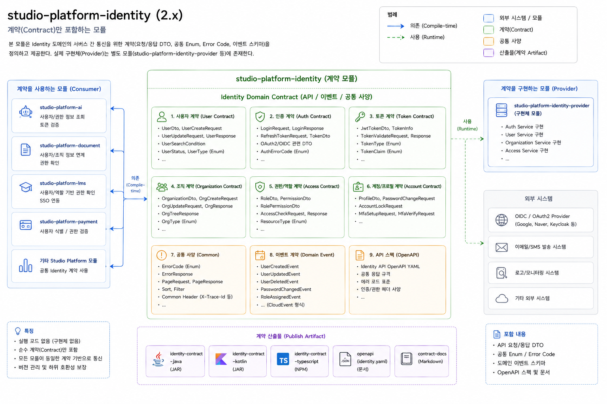

# Studio Platform Identity

실제 인증/인가 기능을 구현하는 서비스 모듈이 아니라, Identity 도메인에서 공통으로 사용하는 계약(Contract)만 정의하는 경량 플랫폼 모듈이다. 본 모듈의 목적은 사용자(User), 조직(Organization), 인증(Auth), 권한(Role/Permission), 토큰(Token) 등 Identity 영역에서 필요한 API 인터페이스, DTO, Enum, 이벤트(Event), 공통 응답 모델 등을 표준화하여 다른 모듈 간 계약 기반 통신을 가능하게 하는 데 있다.

이 모듈은 구현체(Implementation)를 포함하지 않으며, 특정 인증 서버(Keycloak, Okta, Auth0 등)나 외부 시스템에 직접 의존하지 않는다. 대신 Identity 도메인에 대한 공통 계약만 정의하고 export함으로써, 상위 서비스와 구현 모듈 간 결합도를 낮추고 확장 가능한 구조를 제공한다.

구조적으로는 크게 API Contract, Domain Contract, Event Contract, Configuration Contract, Enum/Code Contract, Common Contract 영역으로 구성된다. API Contract 영역에는 로그인, 토큰 발급, 사용자 조회 등 IDaaS 연동 시 필요한 인터페이스와 요청/응답 DTO가 정의된다. Domain Contract 영역에는 사용자(User), 조직(Organization), 역할(Role), 권한(Permission) 등의 공통 도메인 모델 계약이 포함된다.

Event Contract는 사용자 생성/수정/삭제, 로그인/로그아웃, 권한 변경 등의 이벤트 모델을 정의하며, 시스템 간 이벤트 기반 연동 시 공통 스키마 역할을 수행한다. Configuration Contract 영역은 OAuth2/OIDC 연동 설정, Endpoint 정보, Tenant 설정 등 Identity 연계에 필요한 설정 모델을 제공한다. 또한 Enum/Code Contract와 Common Contract를 통해 사용자 상태(UserStatus), 권한 유형(PermissionType), 공통 예외 코드, 공통 응답 모델(PageResponse 등)을 표준화한다.

다른 플랫폼 모듈(studio-platform-auth, studio-platform-user, studio-platform-organization, studio-platform-access 등)은 이 모듈에 컴파일 타임 의존성을 가지며, 동일한 계약 모델을 공유함으로써 모듈 간 데이터 구조와 이벤트 형식을 일관되게 유지할 수 있다. 실제 인증/인가 처리 로직은 별도의 구현 모듈(studio-platform-identity-impl-*)에서 제공되며, 해당 구현 모듈은 Keycloak, Okta, Auth0, Azure AD 등의 외부 IDaaS 시스템과 연동될 수 있다.

이 구조는 “계약(Contract)과 구현(Implementation)의 분리”를 핵심 철학으로 하며, 플랫폼 전체에서 Identity 관련 인터페이스를 표준화하면서도 특정 인증 기술이나 구현체에 대한 의존성을 최소화하는 것을 목표로 한다. 결과적으로 시스템 간 결합도를 낮추고, 구현체 교체 및 확장을 용이하게 하며, 멀티 모듈 기반 플랫폼 아키텍처에서 안정적인 호환성과 버전 관리를 지원하는 역할을 수행한다.

## 요약
userId/username/principal을 공통 타입으로 표현하는 계약 모듈이다.

## 설계
- 인증 프레임워크와 사용자 저장소를 직접 의존하지 않는다.
- `IdentityService`/`PrincipalResolver`로 경계를 나눈다.
- `UserKey`/`UserRef`로 식별 정보를 표준화한다.

## 사용법
- `IdentityService` 구현을 애플리케이션에서 제공
- 보안 어댑터가 `ApplicationPrincipal`/`PrincipalResolver`를 공급

## 확장 포인트
- `IdentityService` 구현 교체(DB/IAM)
- `PrincipalResolver` 구현 교체(Spring Security, 커스텀 세션 등)
- `UserRef` 확장(추가 속성)

## 설정
이 모듈은 자체 설정이 없고, 구현 모듈에서 빈 등록으로 활성화한다.

## 환경별 예시
- **dev**: 간단한 InMemory `IdentityService`로 빠른 테스트
- **stage/prod**: 실제 사용자 저장소 구현을 바인딩하고, PrincipalResolver를 보안 설정과 일치

## YAML 예시
```yaml
studio:
  identity:
    resolver: security
    user-source: database
```

## ADR
- `docs/adr/0001-identity-contract-separation.md`

## 목표
- 모든 모듈에서 동일한 타입으로 userId/username을 처리
- 사용자 시스템(DB/외부 IAM) 교체 시 계약(API)만 유지되면 영향 최소화
- 보안 구현체(UserDetails/Authentication 등)와 직접 결합하지 않음

## 주요 타입
- `UserKey` / `UserIdKey` / `UsernameKey`: 사용자 식별 키
- `UserRef`: userId/username/roles를 담는 참조 객체
- `IdentityService`: 사용자 식별/조회 계약
- `ApplicationPrincipal`: 애플리케이션 전역 principal 추상화
- `PrincipalResolver`: 현재 principal 조회 계약

## 사용 예시
```java
IdentityService identityService = ...;
identityService.resolve(new UserIdKey(100L))
    .ifPresent(ref -> {
        Long userId = ref.userId();
        String username = ref.username();
    });
```

## 구조
- `src/main/java`: 구현/계약
- `src/main/resources`: 리소스

## 구현 분리 원칙
Identity 모듈을 실제로 동작시키기 위해서는 두 종류의 구현 모듈이 필요합니다.
- 보안 어댑터 모듈: Spring Security/Authentication을 받아 `ApplicationPrincipal`/`PrincipalResolver`로 변환
- 사용자 시스템 구현 모듈: 사용자 저장소(DB/IAM)에서 `IdentityService`를 구현

이 분리를 통해 보안 프레임워크나 사용자 시스템이 바뀌어도 공통 계약은 유지됩니다.

## 대응 스타터
이 모듈 자체에 전용 스타터는 없다. 계약 구현체는 아래 스타터들이 제공한다.

| 구현 역할 | 제공 스타터/모듈 |
|---|---|
| `PrincipalResolver` (Spring Security 어댑터) | `starter/studio-platform-starter-security` |
| `IdentityService` (사용자 저장소 구현) | `starter/studio-platform-starter-user` + `studio-platform-user-default` |

```kotlin
// 일반적인 조합
implementation(project(":starter:studio-platform-starter-security"))
implementation(project(":starter:studio-platform-starter-user"))
implementation(project(":studio-platform-user-default"))
```
